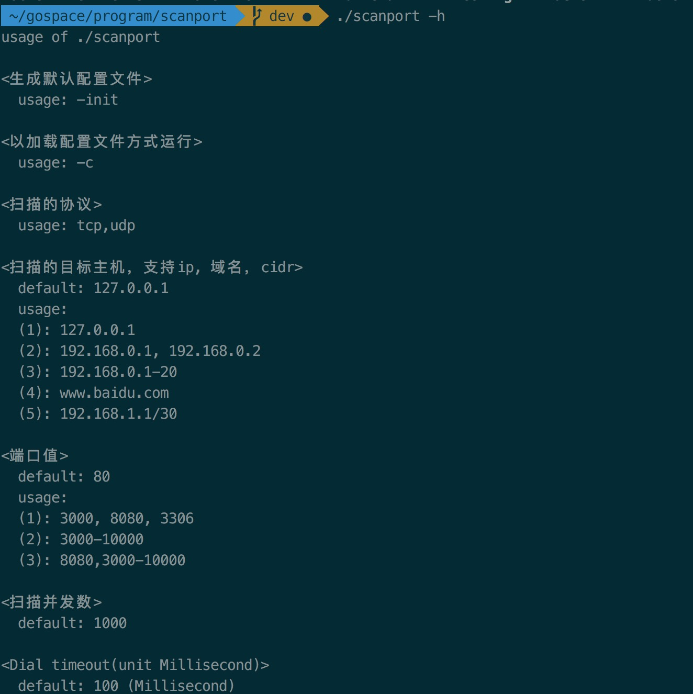
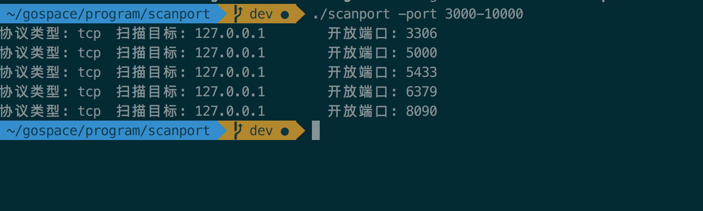

### Info
scanport是一个使用go语言编写的端口扫描程序，内部实现协称池，支持各种灵活的配置

### Feature
- 支持tcp/upd端口
- 扫描目标支持灵活多变的配置
- 端口范围

### Usage
- help


- 结果


- 容器用法
```
docker push bizy01/scanport:latest
docker run -it --rm scanport:latest scanport -target www.baidu.com -port "80,443"
```

### dev
```
# 多平台交叉编译，成果物在dist目录下
make dev

# 将二进制包发布到oss
make pub

# docker镜像构建
make build_img

# 发布docker hub
make pub_image
```